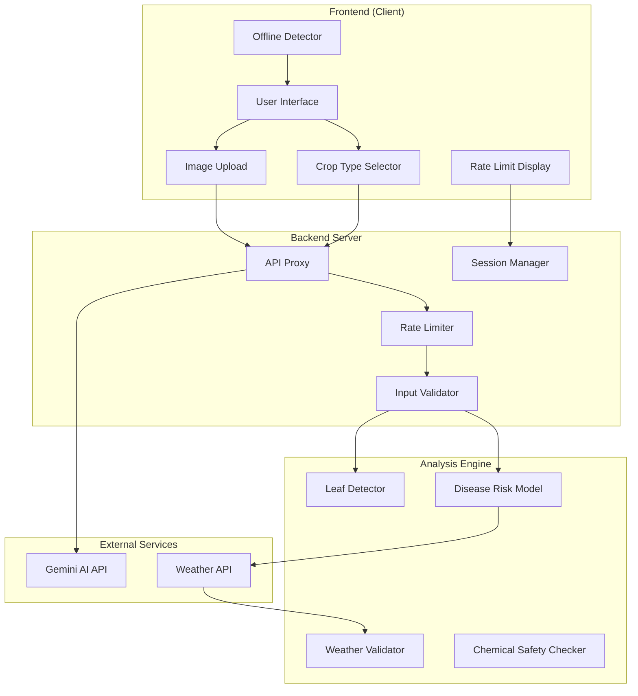

# Design Document: Agricultural Accuracy and Security Fixes

## Overview

This design addresses critical production issues in AgriResolve-AI by implementing disease-specific risk models, hardening security through backend API proxying, improving scientific transparency, and enhancing data reliability. The solution maintains backward compatibility while significantly improving agricultural accuracy and protecting sensitive credentials.

The design follows a layered architecture:
- **Frontend Layer**: User interface with crop selection, rate limiting UI, and offline detection
- **Backend Proxy Layer**: Secure API gateway with rate limiting and input validation
- **Disease Risk Engine**: Crop-specific and disease-specific risk calculation models
- **Image Processing Layer**: Enhanced leaf detection with tightened color filtering
- **Data Validation Layer**: Weather data validation with null handling and timezone management

## Architecture

### System Components



### Data Flow

1. **Image Analysis Request Flow**:
   - User selects crop type and uploads image
   - Frontend checks rate limit status and offline status
   - Request sent to Backend API Proxy with crop type
   - Backend validates session and enforces rate limits
   - Backend validates input (image size, format, crop type)
   - Image processed by Leaf Detector with refined color filtering
   - Backend calls Gemini API with secure credentials
   - Disease Risk Model calculates crop-specific risks
   - Results returned with confidence disclaimers

2. **Weather Data Flow**:
   - Backend fetches weather data with explicit timezone
   - Weather Validator validates ranges and handles nulls
   - Disease Risk Model uses validated data for leaf wetness calculation
   - Missing data communicated to user with uncertainty indicators

## Components and Interfaces

### 1. Disease Risk Model

**Purpose**: Calculate crop-specific and disease-specific risk scores using weather data and leaf wetness duration.

**Interface**:
```typescript
interface DiseaseRiskModel {
  calculateRisk(params: RiskCalculationParams): DiseaseRiskResult;
  calculateLeafWetness(weather: WeatherData, timezone: string): number;
}

interface RiskCalculationParams {
  cropType: CropType;
  weatherData: WeatherData;
  timezone: string;
  leafWetnessHours: number;
}

interface DiseaseRiskResult {
  risks: DiseaseRisk[];
  confidence: ConfidenceScore;
  warnings: string[];
}

interface DiseaseRisk {
  diseaseName: string;
  riskLevel: 'low' | 'medium' | 'high' | 'critical';
  riskScore: number; // 0-100
  factors: RiskFactor[];
}

interface RiskFactor {
  name: string;
  value: number;
  contribution: number; // percentage contribution to risk
}
```

**Disease-Specific Thresholds**:
```typescript
const DISEASE_THRESHOLDS = {
  lateBlight: {
    crops: ['potato', 'tomato'],
    tempMin: 10,
    tempMax: 25,
    minWetnessHours: 10,
    optimalTemp: 18
  },
  powderyMildew: {
    crops: ['grape', 'wheat', 'tomato'],
    tempMin: 15,
    tempMax: 30,
    minWetnessHours: 6,
    optimalTemp: 22
  },
  rust: {
    crops: ['wheat', 'corn', 'soybean'],
    tempMin: 15,
    tempMax: 25,
    minWetnessHours: 8,
    optimalTemp: 20
  },
  // Additional diseases...
};
```

**Leaf Wetness Calculation**:
```typescript
function calculateLeafWetness(weather: WeatherData, timezone: string): number {
  let wetnessHours = 0;
  
  for (const hour of weather.hourlyData) {
    const localTime = convertToTimezone(hour.timestamp, timezone);
    const isDaylight = isDaylightHour(localTime, weather.latitude);
    
    // Base wetness from humidity
    if (hour.relativeHumidity >= 90) {
      wetnessHours += 1;
    }
    
    // Dew point check
    if (hour.dewPoint >= hour.temperature) {
      wetnessHours += 1;
    }
    
    // Wind speed reduction (>3 m/s reduces wetness by 20%)
    if (hour.windSpeed > 3) {
      wetnessHours *= 0.8;
    }
    
    // Solar radiation proxy (daylight increases evaporation)
    if (isDaylight && hour.relativeHumidity < 95) {
      wetnessHours *= 0.7;
    }
  }
  
  return wetnessHours;
}
```

### 2. Enhanced Leaf Detector

**Purpose**: Accurately identify leaf regions while excluding soil, wood, and background objects.

**Interface**:
```typescript
interface LeafDetector {
  detectLeaves(image: ImageData): LeafDetectionResult;
  filterNonLeafRegions(candidates: Region[]): Region[];
}

interface LeafDetectionResult {
  leafRegions: Region[];
  healthyRegions: Region[];
  diseasedRegions: Region[];
  falsePositiveRate: number;
  confidence: number;
}

interface Region {
  boundingBox: BoundingBox;
  pixelCount: number;
  averageHue: number;
  averageSaturation: number;
  averageBrightness: number;
}
```

**Color Filtering Algorithm**:
```typescript
function detectLeaves(image: ImageData): LeafDetectionResult {
  const hsvImage = convertToHSV(image);
  const candidates: Region[] = [];
  
  // Stage 1: Hue-based detection
  for (const pixel of hsvImage) {
    const isHealthyLeaf = pixel.hue >= 70 && pixel.hue <= 170;
    const isDiseasedLeaf = pixel.hue >= 35 && pixel.hue <= 70;
    
    if (isHealthyLeaf || isDiseasedLeaf) {
      candidates.push(pixel);
    }
  }
  
  // Stage 2: Saturation and brightness filtering
  const filtered = candidates.filter(pixel => {
    return pixel.saturation >= 20 &&
           pixel.brightness >= 15 &&
           pixel.brightness <= 95;
  });
  
  // Stage 3: Region grouping and morphological operations
  const regions = groupIntoRegions(filtered);
  const cleanedRegions = applyMorphologicalFilters(regions);
  
  // Stage 4: False positive removal
  const leafRegions = filterNonLeafRegions(cleanedRegions);
  
  return {
    leafRegions,
    healthyRegions: leafRegions.filter(r => r.averageHue >= 70),
    diseasedRegions: leafRegions.filter(r => r.averageHue < 70),
    falsePositiveRate: calculateFalsePositiveRate(leafRegions),
    confidence: calculateDetectionConfidence(leafRegions)
  };
}

function filterNonLeafRegions(candidates: Region[]): Region[] {
  return candidates.filter(region => {
    // Remove regions that are too uniform (likely background)
    const colorVariance = calculateColorVariance(region);
    if (colorVariance < 5) return false;
    
    // Remove regions with texture patterns typical of soil/wood
    const textureScore = calculateTextureScore(region);
    if (textureScore > 0.7) return false;
    
    // Remove very small or very large regions
    const sizeRatio = region.pixelCount / totalImagePixels;
    if (sizeRatio < 0.01 || sizeRatio > 0.8) return false;
    
    return true;
  });
}
```

### 3. Backend API Proxy

**Purpose**: Securely proxy all Gemini API calls while enforcing rate limits and validating inputs.

**Interface**:
```typescript
interface APIProxy {
  proxyAnalysisRequest(request: AnalysisRequest, sessionId: string): Promise<AnalysisResponse>;
  validateRequest(request: AnalysisRequest): ValidationResult;
}

interface AnalysisRequest {
  image: Buffer;
  cropType: CropType;
  location?: GeoLocation;
  sessionId: string;
}

interface AnalysisResponse {
  analysis: AIAnalysis;
  diseaseRisks: DiseaseRisk[];
  confidence: ConfidenceScore;
  disclaimers: string[];
  quotaRemaining: number;
}
```

**Server Implementation** (Express.js):
```typescript
// server/routes/analysis.ts
import express from 'express';
import rateLimit from 'express-rate-limit';

const router = express.Router();

// Rate limiter: 20 requests per hour per session
const apiLimiter = rateLimit({
  windowMs: 60 * 60 * 1000, // 1 hour
  max: 20,
  keyGenerator: (req) => req.session.id,
  handler: (req, res) => {
    res.status(429).json({
      error: 'Rate limit exceeded',
      retryAfter: req.rateLimit.resetTime,
      message: 'Maximum 20 requests per hour. Please try again later.'
    });
  }
});

router.post('/analyze', apiLimiter, async (req, res) => {
  try {
    // Validate input
    const validation = validateAnalysisRequest(req.body);
    if (!validation.valid) {
      return res.status(400).json({ error: validation.errors });
    }
    
    // Check short-term rate limit (5 per 10 minutes)
    const recentRequests = await getRecentRequests(req.session.id, 10);
    if (recentRequests >= 5) {
      return res.status(429).json({
        error: 'Too many requests',
        cooldownSeconds: await getCooldownTime(req.session.id),
        message: 'Maximum 5 requests per 10 minutes. Please wait.'
      });
    }
    
    // Proxy to Gemini API with server-side credentials
    const geminiResponse = await callGeminiAPI({
      image: req.body.image,
      prompt: buildAnalysisPrompt(req.body.cropType),
      apiKey: process.env.GEMINI_API_KEY // Never exposed to client
    });
    
    // Calculate disease risks
    const diseaseRisks = await calculateDiseaseRisks({
      cropType: req.body.cropType,
      weatherData: await fetchWeatherData(req.body.location),
      aiAnalysis: geminiResponse
    });
    
    // Add disclaimers
    const response = {
      analysis: geminiResponse,
      diseaseRisks,
      disclaimers: [
        'Confidence scores are experimental and not scientifically validated.',
        'Chemical recommendations may be incomplete. Consult local agricultural extension.',
        'This tool is for informational purposes. Seek professional advice for critical decisions.'
      ],
      quotaRemaining: 20 - (recentRequests + 1)
    };
    
    res.json(response);
  } catch (error) {
    console.error('Analysis error:', error);
    res.status(500).json({ error: 'Analysis failed', message: error.message });
  }
});

export default router;
```

**Server Configuration**:
```typescript
// server/index.ts
import express from 'express';
import session from 'express-session';
import cors from 'cors';

const app = express();

// Security: Bind to localhost in development
const HOST = process.env.NODE_ENV === 'production' 
  ? process.env.HOST || '0.0.0.0'
  : '127.0.0.1';

const PORT = process.env.PORT || 3001;

// CORS configuration
app.use(cors({
  origin: process.env.FRONTEND_URL || 'http://localhost:3000',
  credentials: true
}));

// Session management
app.use(session({
  secret: process.env.SESSION_SECRET,
  resave: false,
  saveUninitialized: false,
  cookie: {
    secure: process.env.NODE_ENV === 'production',
    httpOnly: true,
    maxAge: 24 * 60 * 60 * 1000 // 24 hours
  }
}));

app.use(express.json({ limit: '10mb' }));

// Routes
app.use('/api/analysis', analysisRouter);

app.listen(PORT, HOST, () => {
  console.log(`Server running on ${HOST}:${PORT}`);
});
```

### 4. Weather Data Validator

**Purpose**: Validate weather data ranges and handle missing values as null rather than fallback values.

**Interface**:
```typescript
interface WeatherValidator {
  validate(data: RawWeatherData): ValidatedWeatherData;
  handleMissingData(data: ValidatedWeatherData): DataAvailability;
}

interface ValidatedWeatherData {
  temperature: number | null;
  relativeHumidity: number | null;
  windSpeed: number | null;
  dewPoint: number | null;
  timestamp: Date;
  timezone: string;
  dataQuality: DataQuality;
}

interface DataAvailability {
  hasTemperature: boolean;
  hasHumidity: boolean;
  hasWindSpeed: boolean;
  canCalculateRisk: boolean;
  missingFields: string[];
}

enum DataQuality {
  COMPLETE = 'complete',
  PARTIAL = 'partial',
  INSUFFICIENT = 'insufficient'
}
```

**Validation Logic**:
```typescript
function validate(data: RawWeatherData): ValidatedWeatherData {
  const validated: ValidatedWeatherData = {
    temperature: validateTemperature(data.temperature),
    relativeHumidity: validateHumidity(data.relativeHumidity),
    windSpeed: validateWindSpeed(data.windSpeed),
    dewPoint: validateDewPoint(data.dewPoint),
    timestamp: new Date(data.timestamp),
    timezone: data.timezone || 'UTC',
    dataQuality: DataQuality.COMPLETE
  };
  
  // Determine data quality
  const nullCount = Object.values(validated).filter(v => v === null).length;
  if (nullCount === 0) {
    validated.dataQuality = DataQuality.COMPLETE;
  } else if (nullCount <= 2) {
    validated.dataQuality = DataQuality.PARTIAL;
  } else {
    validated.dataQuality = DataQuality.INSUFFICIENT;
  }
  
  return validated;
}

function validateTemperature(temp: any): number | null {
  if (temp === null || temp === undefined) return null;
  const numTemp = Number(temp);
  if (isNaN(numTemp)) return null;
  if (numTemp < -50 || numTemp > 60) return null; // Invalid range
  return numTemp;
}

function validateHumidity(rh: any): number | null {
  if (rh === null || rh === undefined) return null;
  const numRH = Number(rh);
  if (isNaN(numRH)) return null;
  if (numRH < 0 || numRH > 100) return null; // Invalid range
  return numRH;
}

function validateWindSpeed(ws: any): number | null {
  if (ws === null || ws === undefined) return null;
  const numWS = Number(ws);
  if (isNaN(numWS)) return null;
  if (numWS < 0) return null; // Cannot be negative
  return numWS;
}
```

### 5. Chemical Safety Checker

**Purpose**: Detect restricted chemicals and their variations/synonyms in user inputs.

**Interface**:
```typescript
interface ChemicalSafetyChecker {
  checkInput(text: string): ChemicalSafetyResult;
  detectVariations(chemicalName: string): string[];
}

interface ChemicalSafetyResult {
  hasRestrictedChemicals: boolean;
  detectedChemicals: DetectedChemical[];
  warnings: string[];
  disclaimer: string;
}

interface DetectedChemical {
  name: string;
  variations: string[];
  restrictionLevel: 'banned' | 'restricted' | 'caution';
  recommendation: string;
}
```

**Detection Patterns**:
```typescript
const CHEMICAL_PATTERNS = {
  volumeUnits: ['ml', 'milliliter', 'millilitre', 'mL', 'millilitres', 'milliliters'],
  massUnits: ['g', 'gram', 'gramme', 'grams', 'grammes'],
  
  restrictedChemicals: [
    {
      names: ['paraquat', 'gramoxone'],
      level: 'banned',
      recommendation: 'This chemical is banned in many regions. Consult local authorities.'
    },
    {
      names: ['chlorpyrifos', 'dursban', 'lorsban'],
      level: 'restricted',
      recommendation: 'This chemical has restrictions. Verify local regulations.'
    },
    // Additional chemicals...
  ]
};

function checkInput(text: string): ChemicalSafetyResult {
  const normalizedText = text.toLowerCase();
  const detected: DetectedChemical[] = [];
  
  for (const chemical of CHEMICAL_PATTERNS.restrictedChemicals) {
    for (const name of chemical.names) {
      // Check for exact match and common variations
      const patterns = [
        name,
        name.replace(/ph/g, 'f'), // Common spelling variations
        name.replace(/s/g, 'z'),
        ...generateCommonMisspellings(name)
      ];
      
      for (const pattern of patterns) {
        if (normalizedText.includes(pattern)) {
          detected.push({
            name: chemical.names[0],
            variations: chemical.names,
            restrictionLevel: chemical.level,
            recommendation: chemical.recommendation
          });
          break;
        }
      }
    }
  }
  
  return {
    hasRestrictedChemicals: detected.length > 0,
    detectedChemicals: detected,
    warnings: detected.map(c => c.recommendation),
    disclaimer: 'This database is incomplete. Always consult local agricultural extension offices before applying any chemicals.'
  };
}
```

### 6. Frontend Rate Limit UI

**Purpose**: Display rate limit status and prevent requests when limits are exceeded.

**Interface**:
```typescript
interface RateLimitUI {
  displayQuota(remaining: number, total: number): void;
  displayCooldown(seconds: number): void;
  checkBeforeRequest(): boolean;
}

interface RateLimitState {
  requestsRemaining: number;
  totalQuota: number;
  cooldownUntil: Date | null;
  lastRequestTime: Date | null;
}
```

**React Component**:
```typescript
function RateLimitIndicator({ state }: { state: RateLimitState }) {
  const percentUsed = ((state.totalQuota - state.requestsRemaining) / state.totalQuota) * 100;
  const isNearLimit = percentUsed >= 80;
  
  return (
    <div className="rate-limit-indicator">
      <div className="quota-bar">
        <div 
          className={`quota-fill ${isNearLimit ? 'warning' : ''}`}
          style={{ width: `${percentUsed}%` }}
        />
      </div>
      <div className="quota-text">
        {state.requestsRemaining} / {state.totalQuota} requests remaining
      </div>
      {isNearLimit && (
        <div className="quota-warning">
          ⚠️ Approaching rate limit. {state.requestsRemaining} requests left.
        </div>
      )}
      {state.cooldownUntil && (
        <div className="cooldown-message">
          ⏱️ Cooldown active. Try again in {formatCooldownTime(state.cooldownUntil)}
        </div>
      )}
    </div>
  );
}
```

### 7. Offline Detector

**Purpose**: Detect network connectivity and communicate feature availability.

**Interface**:
```typescript
interface OfflineDetector {
  isOnline(): boolean;
  onStatusChange(callback: (online: boolean) => void): void;
  checkAPIAvailability(): Promise<boolean>;
}
```

**Implementation**:
```typescript
class OfflineDetector {
  private online: boolean = navigator.onLine;
  private listeners: ((online: boolean) => void)[] = [];
  
  constructor() {
    window.addEventListener('online', () => this.updateStatus(true));
    window.addEventListener('offline', () => this.updateStatus(false));
  }
  
  isOnline(): boolean {
    return this.online;
  }
  
  onStatusChange(callback: (online: boolean) => void): void {
    this.listeners.push(callback);
  }
  
  async checkAPIAvailability(): Promise<boolean> {
    if (!this.online) return false;
    
    try {
      const response = await fetch('/api/health', { 
        method: 'HEAD',
        timeout: 5000 
      });
      return response.ok;
    } catch {
      return false;
    }
  }
  
  private updateStatus(online: boolean): void {
    this.online = online;
    this.listeners.forEach(callback => callback(online));
  }
}
```

## Data Models

### Crop Type Enumeration
```typescript
enum CropType {
  TOMATO = 'tomato',
  POTATO = 'potato',
  WHEAT = 'wheat',
  CORN = 'corn',
  SOYBEAN = 'soybean',
  GRAPE = 'grape',
  APPLE = 'apple'
}

interface CropInfo {
  type: CropType;
  commonDiseases: string[];
  optimalTempRange: [number, number];
  criticalGrowthStages: string[];
}
```

### Disease Risk Data Model
```typescript
interface DiseaseRiskData {
  cropType: CropType;
  diseases: {
    [diseaseName: string]: {
      riskScore: number;
      riskLevel: 'low' | 'medium' | 'high' | 'critical';
      factors: {
        temperature: { value: number | null; contribution: number };
        humidity: { value: number | null; contribution: number };
        leafWetness: { value: number | null; contribution: number };
        windSpeed: { value: number | null; contribution: number };
      };
      thresholds: {
        tempMin: number;
        tempMax: number;
        minWetnessHours: number;
      };
    };
  };
  confidence: {
    overall: number;
    components: {
      weatherData: number;
      imageAnalysis: number;
      modelAccuracy: number;
    };
  };
  dataQuality: DataQuality;
  missingData: string[];
}
```

### Session and Rate Limit Data
```typescript
interface SessionData {
  sessionId: string;
  createdAt: Date;
  requests: RequestRecord[];
  quotaRemaining: number;
}

interface RequestRecord {
  timestamp: Date;
  endpoint: string;
  success: boolean;
  responseTime: number;
}
```

### Weather Data Model
```typescript
interface WeatherData {
  location: GeoLocation;
  timezone: string;
  current: {
    temperature: number | null;
    relativeHumidity: number | null;
    windSpeed: number | null;
    dewPoint: number | null;
    timestamp: Date;
  };
  hourlyData: HourlyWeather[];
  dataQuality: DataQuality;
}

interface HourlyWeather {
  timestamp: Date;
  temperature: number | null;
  relativeHumidity: number | null;
  windSpeed: number | null;
  dewPoint: number | null;
}

interface GeoLocation {
  latitude: number;
  longitude: number;
  timezone: string;
}
```


## Correctness Properties

*A property is a characteristic or behavior that should hold true across all valid executions of a system—essentially, a formal statement about what the system should do. Properties serve as the bridge between human-readable specifications and machine-verifiable correctness guarantees.*

### Property Reflection

After analyzing all acceptance criteria, I identified several areas of redundancy:

**Redundant Properties Eliminated:**
- AC 4.4 and 4.5 are redundant with AC 1.7 and 4.2 (all test crop-disease filtering)
- AC 6.2 is the inverse of AC 6.1 (both test localhost binding)
- AC 11.3 is the inverse of AC 11.1 and 11.2 (all test null handling)
- AC 13.4 is redundant with AC 13.1 (both test chemical variation detection)

**Properties Combined:**
- AC 1.1 and 1.2 can be combined into a single comprehensive property about disease-specific thresholds
- AC 3.3 and 3.4 can be combined into a single property about pixel filtering criteria
- AC 9.1, 9.2, and 9.3 can be combined into a comprehensive confidence display property
- AC 10.1 and 10.2 can be combined into a comprehensive chemical disclaimer property
- AC 11.1 and 11.2 can be combined into a single null handling property

### Disease Risk Model Properties

**Property 1: Disease-specific threshold application**
*For any* crop type and disease combination, when calculating disease risk, the system should apply the correct temperature range and leaf wetness duration thresholds specific to that disease-crop pair.
**Validates: Requirements 1.1, 1.2**

**Property 2: Multiple disease risk calculation**
*For any* crop type that is susceptible to multiple diseases, the system should calculate and return separate risk scores for each applicable disease.
**Validates: Requirements 1.6**

**Property 3: Irrelevant disease filtering**
*For any* crop type and disease combination where the disease does not affect that crop, the disease should be excluded from the risk analysis results.
**Validates: Requirements 1.7, 4.2**

**Property 4: Solar radiation effect on leaf wetness**
*For any* weather data with hourly timestamps, leaf wetness duration calculations during daylight hours should apply higher evaporation rates than nighttime hours.
**Validates: Requirements 2.1, 2.4**

**Property 5: Wind speed effect on leaf wetness**
*For any* weather data containing wind speed measurements, leaf wetness duration should decrease as wind speed increases.
**Validates: Requirements 2.2**

**Property 6: Dew point wetness detection**
*For any* hourly weather record where dew point temperature equals or exceeds air temperature, that hour should be counted as a wet hour in leaf wetness calculations.
**Validates: Requirements 2.6**

### Leaf Detection Properties

**Property 7: Healthy leaf hue range detection**
*For any* image pixel with hue value between 70 and 170 degrees (and meeting saturation/brightness criteria), the pixel should be classified as a candidate healthy leaf region.
**Validates: Requirements 3.1**

**Property 8: Diseased leaf hue range detection**
*For any* image pixel with hue value between 35 and 70 degrees (and meeting saturation/brightness criteria), the pixel should be classified as a candidate diseased leaf region.
**Validates: Requirements 3.2**

**Property 9: Pixel filtering criteria**
*For any* candidate leaf pixel, if its saturation is below 20% OR its brightness is below 15% OR above 95%, it should be excluded from leaf regions.
**Validates: Requirements 3.3, 3.4**

**Property 10: False positive rate threshold**
*For any* set of test images containing non-leaf objects (soil, wood, background), the leaf detector's false positive rate should be below 5%.
**Validates: Requirements 3.6**

### Security Properties

**Property 11: Backend API proxying**
*For any* Gemini API request initiated by the system, the request must be routed through the backend server proxy and never made directly from the client.
**Validates: Requirements 5.1**

**Property 12: API key protection**
*For any* client-side code or network traffic inspection, Gemini API keys should never be exposed or discoverable.
**Validates: Requirements 5.2**

**Property 13: Request validation before proxying**
*For any* API request received by the backend server, input validation must occur before the request is forwarded to the Gemini API.
**Validates: Requirements 5.3**

**Property 14: Response sanitization**
*For any* API response returned by the backend server to the client, sensitive information should be removed or sanitized.
**Validates: Requirements 5.5**

### Rate Limiting Properties

**Property 15: Request tracking**
*For any* analysis request made by a user, the rate limiter should increment the request count for that user's session.
**Validates: Requirements 7.1**

**Property 16: Usage indicator updates**
*For any* analysis request completion, the system should update the displayed usage indicators to reflect the new request count.
**Validates: Requirements 15.5**

### Input Validation Properties

**Property 17: Temperature range validation**
*For any* temperature value received from weather data, if the value is outside the range -50°C to 60°C, it should be rejected or set to null.
**Validates: Requirements 8.1**

**Property 18: Humidity range validation**
*For any* relative humidity value received from weather data, if the value is outside the range 0% to 100%, it should be rejected or set to null.
**Validates: Requirements 8.2**

**Property 19: Wind speed non-negativity validation**
*For any* wind speed value received from weather data, if the value is negative, it should be rejected or set to null.
**Validates: Requirements 8.3**

**Property 20: Input sanitization**
*For any* user text input received by the system, the input should be sanitized to remove or escape characters that could enable injection attacks.
**Validates: Requirements 8.4**

**Property 21: Image file type validation**
*For any* uploaded file, if the file type is not an accepted image format (JPEG, PNG, WebP), the upload should be rejected.
**Validates: Requirements 8.5**

**Property 22: Image file size validation**
*For any* uploaded file, if the file size exceeds 10MB, the upload should be rejected.
**Validates: Requirements 8.6**

### Transparency and Disclaimer Properties

**Property 23: Confidence score disclaimer display**
*For any* page or component displaying confidence scores, the system should show a disclaimer that scores are experimental, provide a breakdown of confidence components, and recommend consulting professionals.
**Validates: Requirements 9.1, 9.2, 9.3**

**Property 24: Low confidence warning**
*For any* confidence score below 60%, the system should display an additional warning about low confidence beyond the standard disclaimer.
**Validates: Requirements 9.5**

**Property 25: Chemical database disclaimer display**
*For any* page or component displaying chemical recommendations, the system should show a disclaimer that the database is incomplete and recommend consulting local agricultural extension offices.
**Validates: Requirements 10.1, 10.2**

**Property 26: Restricted chemical warning**
*For any* detected restricted chemical in user input or recommendations, the system should display a warning along with the chemical database disclaimer.
**Validates: Requirements 10.4**

### Weather Data Handling Properties

**Property 27: Null handling for missing weather data**
*For any* weather data field (temperature, humidity, wind speed) that is missing or unavailable from the API, the system should set the value to null rather than using zero or a default fallback value.
**Validates: Requirements 11.1, 11.2**

**Property 28: Missing data notification**
*For any* weather data containing null values, the system should notify the user which specific data fields are unavailable.
**Validates: Requirements 11.4, 11.6**

**Property 29: Incomplete risk calculation indication**
*For any* disease risk calculation where critical weather data (temperature or humidity) is null, the system should indicate that the risk calculation may be incomplete.
**Validates: Requirements 11.5**

### Timezone Handling Properties

**Property 30: Timezone specification in weather requests**
*For any* weather data request, the system should explicitly include the user's timezone in the request parameters.
**Validates: Requirements 12.1**

**Property 31: Timezone validation in timestamps**
*For any* weather timestamp processed by the system, timezone information must be present and validated.
**Validates: Requirements 12.2**

**Property 32: Timezone-aware leaf wetness calculation**
*For any* leaf wetness duration calculation, the system should use timezone-aware timestamps to correctly determine daylight hours for evaporation rate adjustments.
**Validates: Requirements 12.4**

**Property 33: Local timezone display**
*For any* timestamp displayed to the user, the time should be shown in the user's local timezone.
**Validates: Requirements 12.5**

### Chemical Safety Properties

**Property 34: Chemical variation detection**
*For any* restricted chemical with known spelling variations or synonyms, the chemical safety checker should detect all variations when present in user input.
**Validates: Requirements 13.1**

**Property 35: Consistent warnings for chemical variations**
*For any* detected chemical variation or synonym, the system should apply the same safety warnings as the primary chemical name.
**Validates: Requirements 13.5**

### Offline Detection Properties

**Property 36: Pre-call offline detection**
*For any* API call attempt, the system should check offline status before making the request.
**Validates: Requirements 14.4**

**Property 37: Service failure error messaging**
*For any* service failure (Gemini API, weather API, etc.), the system should display a specific error message indicating which service is unavailable.
**Validates: Requirements 16.3**

**Property 38: Graceful degradation on service failure**
*For any* single service failure, the system should continue to provide other available features without crashing.
**Validates: Requirements 16.4, 16.5**

## Error Handling

### Error Categories and Responses

**1. Network and API Errors**
- **Offline Detection**: Check `navigator.onLine` before API calls
- **API Timeout**: 30-second timeout for Gemini API calls, 10-second timeout for weather API
- **API Failure**: Display specific error message, offer retry option, log error details
- **Rate Limit Exceeded**: Display cooldown timer, show quota reset time, prevent further requests

**2. Validation Errors**
- **Invalid Image**: Reject with clear message about accepted formats and size limits
- **Invalid Weather Data**: Set invalid values to null, notify user of missing data
- **Invalid Crop Type**: Reject with list of supported crop types
- **Invalid Input**: Sanitize and log potential injection attempts

**3. Data Quality Errors**
- **Insufficient Weather Data**: Display warning, indicate which calculations are affected
- **Low Confidence Score**: Display additional warning, recommend professional consultation
- **Missing Timezone**: Prompt user for location or timezone selection

**4. Service Degradation**
- **Gemini API Unavailable**: Offer cached results if available, display maintenance message
- **Weather API Unavailable**: Allow manual weather data entry, use cached data if recent
- **Partial Service Failure**: Continue with available services, clearly indicate unavailable features

### Error Response Format

```typescript
interface ErrorResponse {
  error: string;
  code: ErrorCode;
  message: string;
  details?: any;
  retryable: boolean;
  retryAfter?: number;
  affectedFeatures?: string[];
}

enum ErrorCode {
  RATE_LIMIT_EXCEEDED = 'RATE_LIMIT_EXCEEDED',
  INVALID_INPUT = 'INVALID_INPUT',
  SERVICE_UNAVAILABLE = 'SERVICE_UNAVAILABLE',
  NETWORK_ERROR = 'NETWORK_ERROR',
  VALIDATION_ERROR = 'VALIDATION_ERROR',
  INSUFFICIENT_DATA = 'INSUFFICIENT_DATA'
}
```

### Error Handling Patterns

```typescript
// Graceful degradation example
async function analyzeImage(request: AnalysisRequest): Promise<AnalysisResponse> {
  const errors: string[] = [];
  const warnings: string[] = [];
  
  // Check offline status
  if (!navigator.onLine) {
    throw new Error('No internet connection. This feature requires internet access.');
  }
  
  // Fetch weather data with fallback
  let weatherData: WeatherData | null = null;
  try {
    weatherData = await fetchWeatherData(request.location);
  } catch (error) {
    warnings.push('Weather data unavailable. Disease risk calculations will be limited.');
    weatherData = null;
  }
  
  // Validate weather data
  if (weatherData) {
    const validated = validateWeatherData(weatherData);
    if (validated.dataQuality === DataQuality.INSUFFICIENT) {
      warnings.push('Weather data quality is insufficient for accurate risk assessment.');
    }
    weatherData = validated;
  }
  
  // Perform AI analysis
  let aiAnalysis: AIAnalysis;
  try {
    aiAnalysis = await callGeminiAPI(request);
  } catch (error) {
    if (error.code === 'RATE_LIMIT_EXCEEDED') {
      throw new RateLimitError(error.retryAfter);
    }
    throw new Error('AI analysis service is temporarily unavailable.');
  }
  
  // Calculate disease risks (may be partial if weather data is missing)
  const diseaseRisks = weatherData 
    ? calculateDiseaseRisks(request.cropType, weatherData, aiAnalysis)
    : [];
  
  if (diseaseRisks.length === 0 && !weatherData) {
    warnings.push('Disease risk assessment unavailable without weather data.');
  }
  
  return {
    analysis: aiAnalysis,
    diseaseRisks,
    warnings,
    errors,
    confidence: calculateConfidence(aiAnalysis, weatherData)
  };
}
```

## Testing Strategy

### Dual Testing Approach

This feature requires both **unit tests** and **property-based tests** for comprehensive coverage:

- **Unit Tests**: Verify specific examples, edge cases, and error conditions
- **Property Tests**: Verify universal properties across randomized inputs

Both testing approaches are complementary and necessary. Unit tests catch concrete bugs in specific scenarios, while property tests verify general correctness across a wide input space.

### Property-Based Testing Configuration

**Library Selection**: 
- **JavaScript/TypeScript**: Use `fast-check` library
- **Python**: Use `hypothesis` library (if backend components are in Python)

**Test Configuration**:
- Minimum **100 iterations** per property test (due to randomization)
- Each property test must reference its design document property
- Tag format: `Feature: agricultural-accuracy-and-security-fixes, Property {number}: {property_text}`

### Testing Scope by Component

**1. Disease Risk Model Testing**

*Unit Tests*:
- Test specific disease thresholds (late blight, powdery mildew, rust)
- Test edge cases: exactly at threshold boundaries
- Test with missing weather data (all null values)
- Test with single crop, single disease
- Test timezone edge cases (midnight, DST transitions)

*Property Tests*:
- Property 1: Disease-specific threshold application (test with random crop-disease pairs)
- Property 2: Multiple disease risk calculation (test with random multi-disease crops)
- Property 3: Irrelevant disease filtering (test with random invalid crop-disease pairs)
- Property 4: Solar radiation effect (test with random hourly weather data)
- Property 5: Wind speed effect (test with random wind speeds)
- Property 6: Dew point wetness detection (test with random temperature/dewpoint combinations)

**2. Leaf Detector Testing**

*Unit Tests*:
- Test with pure green image (hue 120°)
- Test with pure yellow image (hue 50°)
- Test with grayscale image (low saturation)
- Test with very dark/bright images
- Test with known non-leaf objects (soil, wood samples)

*Property Tests*:
- Property 7: Healthy leaf hue range (test with random hue values)
- Property 8: Diseased leaf hue range (test with random hue values)
- Property 9: Pixel filtering criteria (test with random HSV values)
- Property 10: False positive rate (test with random non-leaf images)

**3. Backend API Proxy Testing**

*Unit Tests*:
- Test successful proxy request
- Test rate limit enforcement at exactly 5 requests in 10 minutes
- Test rate limit enforcement at exactly 20 requests in 1 hour
- Test with invalid session ID
- Test with malformed request body
- Test API key is not in response headers

*Property Tests*:
- Property 11: Backend API proxying (test with random valid requests)
- Property 12: API key protection (inspect all responses for key patterns)
- Property 13: Request validation (test with random invalid inputs)
- Property 14: Response sanitization (test with random API responses)
- Property 15: Request tracking (test with random request sequences)
- Property 16: Usage indicator updates (test with random request counts)

**4. Input Validation Testing**

*Unit Tests*:
- Test temperature at boundaries (-50°C, 60°C)
- Test humidity at boundaries (0%, 100%)
- Test wind speed at 0 and negative values
- Test common injection patterns (SQL, XSS)
- Test image formats (JPEG, PNG, WebP, invalid formats)
- Test image size at 10MB boundary

*Property Tests*:
- Property 17: Temperature range validation (test with random temperatures)
- Property 18: Humidity range validation (test with random humidity values)
- Property 19: Wind speed validation (test with random wind speeds)
- Property 20: Input sanitization (test with random malicious patterns)
- Property 21: Image file type validation (test with random file types)
- Property 22: Image file size validation (test with random file sizes)

**5. Transparency and Disclaimer Testing**

*Unit Tests*:
- Test confidence display with score = 59% (should show low confidence warning)
- Test confidence display with score = 60% (should not show extra warning)
- Test chemical display with restricted chemical detected
- Test chemical display with no restricted chemicals

*Property Tests*:
- Property 23: Confidence score disclaimer display (test with random confidence scores)
- Property 24: Low confidence warning (test with random scores below 60%)
- Property 25: Chemical database disclaimer display (test with random chemical lists)
- Property 26: Restricted chemical warning (test with random chemical inputs)

**6. Weather Data Handling Testing**

*Unit Tests*:
- Test with all weather fields null
- Test with only temperature null
- Test with only humidity null
- Test with invalid temperature (e.g., 100°C)
- Test with invalid humidity (e.g., 150%)

*Property Tests*:
- Property 27: Null handling (test with random missing data patterns)
- Property 28: Missing data notification (test with random null combinations)
- Property 29: Incomplete risk calculation indication (test with random critical nulls)

**7. Timezone Handling Testing**

*Unit Tests*:
- Test with UTC timezone
- Test with positive offset timezone (e.g., +05:30)
- Test with negative offset timezone (e.g., -08:00)
- Test with missing timezone (should prompt user)
- Test daylight calculation at noon vs midnight

*Property Tests*:
- Property 30: Timezone specification (test with random timezones)
- Property 31: Timezone validation (test with random timestamp formats)
- Property 32: Timezone-aware calculations (test with random timezone offsets)
- Property 33: Local timezone display (test with random user timezones)

**8. Chemical Safety Testing**

*Unit Tests*:
- Test with "ml" vs "milliliter" vs "millilitre"
- Test with "g" vs "gram" vs "gramme"
- Test with known restricted chemical names
- Test with common misspellings

*Property Tests*:
- Property 34: Chemical variation detection (test with random variations)
- Property 35: Consistent warnings (test with random chemical synonyms)

**9. Offline Detection and Graceful Degradation Testing**

*Unit Tests*:
- Test with navigator.onLine = false
- Test with Gemini API returning 503
- Test with weather API timeout
- Test with both APIs unavailable

*Property Tests*:
- Property 36: Pre-call offline detection (test with random online/offline states)
- Property 37: Service failure messaging (test with random service failures)
- Property 38: Graceful degradation (test with random service availability combinations)

### Integration Testing

**End-to-End Scenarios**:
1. Complete analysis flow: upload image → select crop → receive analysis with disease risks
2. Rate limiting flow: make 6 requests rapidly → verify cooldown message
3. Offline flow: disconnect network → attempt analysis → verify offline message
4. Missing weather data flow: simulate weather API failure → verify manual entry option
5. Low confidence flow: receive low confidence result → verify extra warnings displayed

### Test Data Requirements

**Image Test Dataset**:
- 50+ images of healthy leaves (various crops)
- 50+ images of diseased leaves (various diseases)
- 50+ images of non-leaf objects (soil, wood, sky, tools)
- Images with various lighting conditions
- Images with various backgrounds

**Weather Test Data**:
- Valid weather data for various climates
- Weather data with missing fields
- Weather data with invalid values
- Weather data with various timezones

**Chemical Test Data**:
- List of restricted chemicals with variations
- Common agricultural chemical names
- Misspellings and synonyms

### Continuous Testing

**Pre-commit Hooks**:
- Run unit tests for modified components
- Run linting and type checking
- Verify no API keys in code

**CI/CD Pipeline**:
- Run full unit test suite
- Run property-based tests (100 iterations each)
- Run integration tests
- Check code coverage (target: >80%)
- Security scanning for exposed credentials
- Performance testing for image processing

### Manual Testing Checklist

- [ ] Verify localhost binding in development mode
- [ ] Verify API keys not visible in browser DevTools
- [ ] Test rate limiting with actual requests
- [ ] Test offline detection by disabling network
- [ ] Verify disclaimers are prominent and readable
- [ ] Test with real crop images from various sources
- [ ] Verify timezone handling with different user locations
- [ ] Test graceful degradation by stopping backend services
- [ ] Verify chemical safety warnings display correctly
- [ ] Test responsive design on mobile devices
